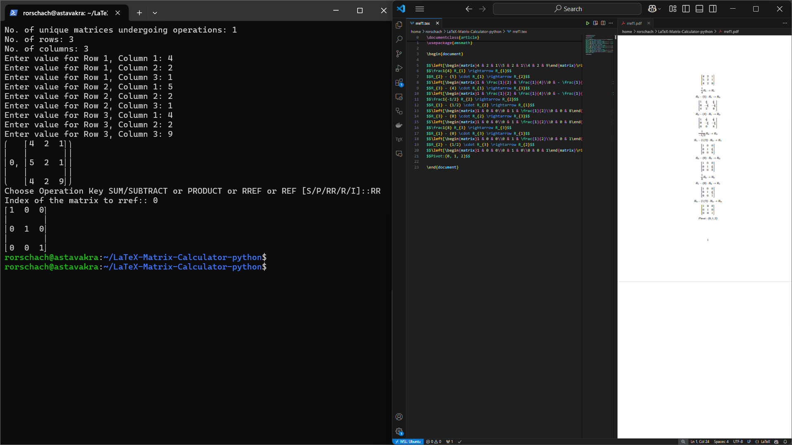

# Hi there, I'm Rahul R. Sah!

## About Me
- 🔭 I’m currently working in Neelcamp.
- 🌱 I’m currently learning ElasticSearch.
- 👯 I’m looking to collaborate on Search/Recommendations, Numercial Computation, & ML/AI.
- 📫 How to reach me: rahulranjann45@gmail.com.

## My Skills
- Languages:    
- Libraries:            
- Frameworks: 
- Databases:  
- Cloud:    
- Testing: 
- Tools:      
- Others:   

## GitHub Stats

## Let's Connect

## 🚀 Featured Projects

Here are some of the projects I'm proud of:

### [SpectralML](https://github.com/rahulranjansah/SpectralML)
This is a machine learning project of predicting Asteroids of SMASS survey using multiclass SVM model. Further, we use Gaussian Mixture Models to confirm the presence of non-gaussian datasets.

  
  
   
  <em>Left: Reflectance vs Wavelength | Original vs Reconstructed </em>

---

### [Hapsira -- Open Source Contribution](https://github.com/rahulranjansah/hapsira)
Open Source Contribution reviewing for adding 3D visualization features for rendering asteroids & comets using NASA's SPICE data. Wrote custom script setup tools for data conversion utilizing Jet Propulsion Labs *dskexp* tool

  
    
   
  <em>Benu Animation | Comet67P</em>

---

### [Cassini Paper Reproducing](https://github.com/rahulranjansah/SpectralML)
Reproducing Cassini's Cosmic Dust Analyzer (CDA) Research Paper to beat paper's baseline model using ML models.

  
  
   
  <em>Left: Calibration final model | Right: Dashboard website</em>

---

### [Pizzaterminal](https://github.com/rahulranjansah/pizzaterminal/tree/master)

A project using Python wrapper for the Dominos Pizza API to order pizza from the terminal.

  
   
  <em>Demo Pizzaterminal</em>

### [LaTeX-Matrix Calculator](https://github.com/rahulranjansah/LaTeX-Matrix-Calculator-python)

A matrix calculator for solving matrix of shape m*n. It has built-in feature of getting latex output of the computation in .tex and .pdf format support with clean formatting for REFs, RREFs, Arithmetic operations, and Dot product

  
   
  <em>Demo Latex Workflow</em>

---

### [Numerical Computations](https://github.com/rahulranjansah/Phy-504)

Solving Schrodinger's equation, Runge-Kutta method, Partial Differential Equations, and Odinary Differential Equations using Python. To plot hydrogen excitations, modelling zombie apocalypse, and more.

  
  
  
   
  <em>Left: Harmonic oscillations model | Right: Zombie Apoclypse | Down: Hydrogen excitation</em>

